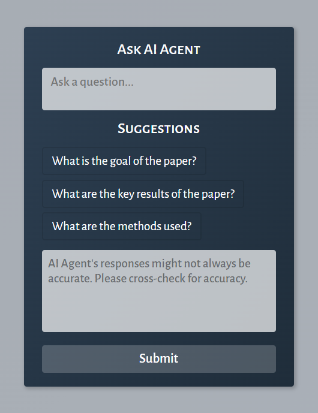
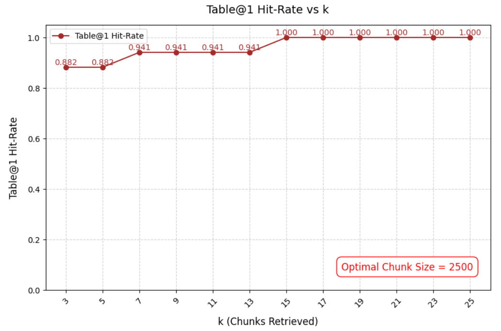

# ResearchPaL: Your AI-powered Multi-Agent Research Copilot

## What is ResearchPaL?

**ResearchPaL** is an intelligent AI-powered research assistant, designed to help you navigate complex academic papers effortlessly. Equipped with cutting-edge **multi-agent AI** technology, ResearchPaL can read and analyze research papers for you, delivering clear, concise answers to your questions. Unlike traditional AI tools, it doesn’t just process text—it also understands **figures and tables**, making it a truly multi-modal assistant. Whether you're a researcher, student, or professional, ResearchPaL ensures you **grasp academic papers in minutes rather than hours**.

## Why you might need ResearchPaL?

The AI research landscape is evolving rapidly, with groundbreaking papers emerging **every week**. Keeping up with this flood of information is overwhelming, if not impossible, for a single person. **ResearchPaL is built to solve this problem.**

- **Instant Paper Summarization:** Get key insights without reading the full text.
- **Deep Understanding Beyond Text:** Unlike other tools, ResearchPaL **extracts figures and tables**, allowing for a richer, more accurate understanding.
- **Multi-Modal RAG Architecture:** It processes both **text and images**, making explanations more precise.
- **Advanced AI Agents:** Ask detailed questions, and ResearchPaL will provide clear, well-structured answers in seconds.
- **Stay Updated Effortlessly:** No need to manually sift through long papers—ResearchPaL distills the most relevant information for you.

## Multi-modal RAG Architecture

**ResearchPaL** leverages a powerful **multi-modal Retrieval-Augmented Generation (RAG) architecture**, enabling it to process **both text and images** for a deeper understanding of research papers. You can attach figures, tables, or entire files along with your queries, and ResearchPaL will intelligently analyze them to provide accurate answers.

The system offers two parsing modes:

- **Default Parsing:** Supports text-based queries but does not directly process figures or tables.
- **Advanced Parsing:** Grants direct access to figures and tables within the paper, making explanations significantly more precise.

By integrating multi-modal capabilities, ResearchPaL ensures that **complex data, diagrams, and visual insights are never lost in translation**—giving you a more comprehensive grasp of any research paper.

**Architecture Overview:**

#### How does ResearchPaL access Figures & Tables?

Academic papers are often packed with **critical information in figures and tables**. Unlike traditional AI assistants that rely solely on text, **ResearchPaL extracts and analyzes these visual components** for a richer and more insightful research experience.

Using the [Adobe PDF Extract API](https://developer.adobe.com/document-services/apis/pdf-extract/), ResearchPaL accurately retrieves:

- **Figures** as high-quality `.png` images
- **Tables** converted into structured `.csv` formats

🔹 **Want AI agents to access these figures & tables directly?**
 Simply enable **Advanced Parsing** in ResearchPaL. If using Default Parsing, you can still upload screenshots of figures/tables for analysis.

With this capability, **ResearchPaL bridges the gap between raw data and meaningful insights**, making research more efficient and accessible than ever before.

## Application System Design

#### Tech Stack used:

ResearchPaL is built on a **cutting-edge, scalable and production-ready tech stack**, ensuring high performance, reliability, and seamless AI-driven research assistance.

- **Frontend**: `ReactJS` + `TypeScript`
- **Backend**: `FastAPI` + `Google Cloud Run` + `Google Cloud Storage` + `Pinecone` + `Adobe PDF Extract` + `Flask`
- **AI Agents**: `LangChain` (.js) + `LangGraph` (.js)

#### System Architecture (High Level):

### 🔐 How Your API Keys Are Handled

User security and privacy are top priorities. Your API keys are **never stored on our servers**—instead, they are **securely encrypted and stored locally on your machine**.

- **Local Storage Only:** Your API keys remain on your device and are never transmitted to external servers.
- **End-to-End Encryption:** Every key is securely encrypted, ensuring maximum protection.
- **Minimal Server Communication:** All AI agent calls are processed directly on your machine, meaning your keys **never leave your local environment**.
- **Full Transparency:** ResearchPaL is **open-source**, allowing you to verify how your API keys are handled. Check out the code [here](https://github.com/ShashankRapolu07?tab=repositories).

**How We Handle Your API Keys:**

|     OpenAI/ Anthropic/ Groq      |              Google              |              Adobe               |
| :------------------------------: | :------------------------------: | :------------------------------: |
|  |  |  |

## Key Features of ResearchPaL

### 1️⃣ Ask AI Agent – Your Instant Research Guide

*Not sure if a paper is worth reading?* **Ask AI Agent** provides a **quick, high-level summary** of any research paper, helping you grasp its core ideas **in seconds**. This feature lets you decide whether the paper is relevant to your needs—saving you **hours of reading time**.

|            Empty State            |            After Query            |
| :-------------------------------: | :-------------------------------: |
|  |  |

### 2️⃣ Citation Mode – Authenticity at Its Best

*Not sure about authenticity of **ResearchPaL's** explanations?* **Citation Mode** ensures that generated responses include **direct quotes** from the paper, giving you **credible, verifiable answers**. Use this feature when authenticity is critical!

|             Normal Mode              |              Citation Mode              |
| :----------------------------------: | :-------------------------------------: |
|  |  |

No additional token usage or API requests are consumed by the **Citation mode**.

### 3️⃣ Follow-Up Suggestions – Navigate Papers Like a Pro

*Need proper guidance through the paper?* **Follow-Up Suggestions** provide **smart, context-aware prompts** to help you **explore deeper insights** without missing key details. This feature enhances your research journey by guiding you through the paper efficiently.

**Note:** Incurs additional token usage and +1 API request.

### 4️⃣ Retrieval Quality Enhancer Mode – Unlock Deeper Insights

*Need a detailed explanation or a full paper summary?* This mode **expands AI’s access to larger sections of the paper**, ensuring **comprehensive answers** to your queries. Ideal for summarizing complex papers **without missing crucial details**.

**Note:** Incurs additional token usage and +1 API request.

## Evaluation and Results

The performance of the **multi-modal RAG architecture** was rigorously evaluated using a small-scale **custom-built academic dataset**, specifically designed to assess retrieval efficiency and accuracy. The complete evaluation dataset, along with the corresponding results, is available [here](https://github.com/ShashankRapolu07?tab=repositories).

The system was evaluated using the following key metrics:

- **Context Recall:** Measures how much relevant information is retrieved from a single paper.
- **Context Precision:** Measures how much irrelevant information is retrieved from a single paper.
- **Figure@1 Hit-Rate:** Measures if relevant figure (only 1) is retrieved from the paper.
- **Table@1 Hit-Rate:** Measures if relevant table (only 1) is retrieved from the paper.
- **Query Latency:** Time taken from query submission till retrieval of documents from the docstore.
- **Response Latency:** Time taken from query submission till generation of <u>1st</u> token by the generation agent.

**Note:** No generation metrics are considered (primarily for assessing faithfulness) in the evals. This is because of separate inclusion of the  **Citation Mode**, which takes care of maintaining authenticity of generated responses by <u>directly citing authors' statements</u>.

|           Context Recall Plot (Default Mode)            |
| :-----------------------------------------------------: |
|  |

|            Context Precision Plot (Default Mode)             |
| :----------------------------------------------------------: |
|  |

**Optimal Values of Chunk Size and k (Default Mode):**

A threshold of `0.90` is considered for Context Recall. Based on this and above plots, the best Context Precision is achieved for `(2500, 9)` pair. Therefore `chunk size = 2500` and `k = 9` are chosen as optimal values for default mode.

|   Context Precision & Context Recall Plots (Advanced Mode)   |
| :----------------------------------------------------------: |
|  |

|            Figure@1 Hit-Rate Plot (Advanced Mode)            |
| :----------------------------------------------------------: |
|  |

|            Table@1 Hit-Rate Plot (Advanced Mode)             |
| :----------------------------------------------------------: |
|  |

**Optimal Values of Chunk Size and k (Advanced Mode):**

Advanced mode uses <u>same</u> text chunks from Default mode. This means the constraint on Advanced mode is: `chunk size = 2500`. Considering Context Recall threshold of `0.9` and from the *Context Precision & Context Recall Plots (Advanced Mode)*, *Figure@1 Hit-Rate* and *Table@1 Hit-Rate* plots, optimal value of number of retrieved chunks is `k = 15`.

**Query Latencies and Response Latencies:**

To evaluate real-time performance, *P50* latencies (median values) were measured for different query types across **Default Mode** and **Advanced Mode**.

<table>
    <thead>
        <tr>
            <th>Category</th>
            <th colspan="2">Query Latency (ms)</th>
            <th colspan="2">Response Latency (ms)</th>
        </tr>
        <tr>
            <th></th>
            <th>Default</th>
            <th>Advanced</th>
            <th>Default</th>
            <th>Advanced</th>
        </tr>
    </thead>
    <tbody>
        <tr>
            <td><b>Only Text</b></td>
            <td style="background-color: #90EE90;"><b>646.5</b></td>
            <td>869.5</td>
            <td style="background-color: #90EE90;"><b>2620.5</b></td>
            <td>4374.5</td>
        </tr>
        <tr>
            <td><b>Text + Image</b></td>
            <td>3351.5</td>
            <td>3965.0</td>
            <td>6958.5</td>
            <td>8494.0</td>
        </tr>
        <tr>
            <td><b>Text + File</b></td>
            <td>1865.0</td>
            <td>1988.5</td>
            <td>3783.5</td>
            <td>5147.0</td>
        </tr>
    </tbody>
</table>

**Note:**

- Above evaluated latencies are for **Gemini models** in their <u>free version</u>. **Groq models** demonstrated lower latencies compared to Gemini models, though **OpenAI/Anthropic models** were not benchmarked due to accessibility constraints.

- The system achieved **industry-standard performance** for **text-only queries**, with:
  - **Query Latency < 1 second**
  - **Response Latency < 3 seconds**
- Multi-modal queries (**text + figures/tables**) exhibited **higher latencies**, primarily due to additional processing for **image and table extraction**.

## **Limitations and Future Improvements**

While **ResearchPaL** delivers a highly efficient and accurate research assistance experience, there are still areas for enhancement and expansion.

#### 1. Code Integration

Currently, ResearchPaL focuses exclusively on **text-based research papers**, without incorporating **associated code implementations**. Future updates aim to include **direct integration with code repositories** linked to research papers, allowing for **practical experimentation and reproducibility of results**.

#### 2. Groq Model Constraints

At present, **Groq models** have **limited access** to full paper contexts and **lack multi-modal capabilities**. This is primarily due to:

- **Strict token limitations** that restrict long-context processing.
- **Absence of production-ready vision models** required for figure and table analysis.

Future iterations will explore **optimized prompt engineering** and **hybrid model approaches** to improve retrieval quality for Groq models.

#### 3. Enhanced Interactive Citation Mode

ResearchPaL's **Citation Mode** already ensures high authenticity by quoting **direct excerpts from research papers**. However, the **Advanced Parsing framework** also provides **bounding box metadata**, which can be leveraged to make **citations more interactive**.

🔹 Future improvements will include:

- **Clickable citations** that highlight and reference the exact location in the original paper.
- **Dynamic source linking** to enhance user navigation and verification.